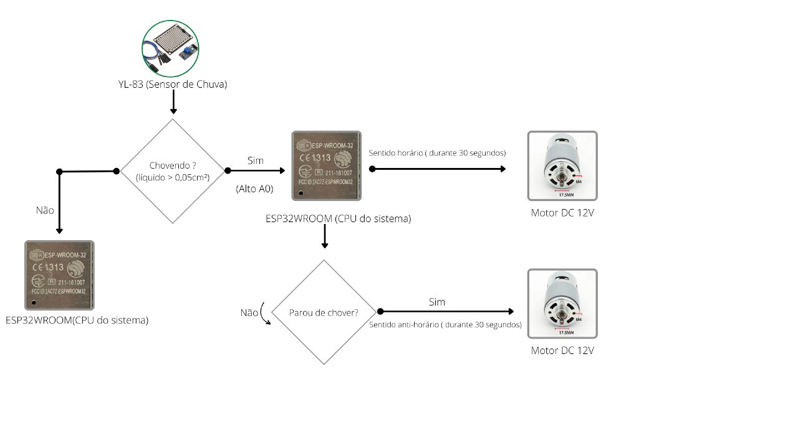

# `<Varal Inteligente>`

  

  

# `<Smart Clothesline>`  

## Apresentação

O presente projeto foi originado no contexto das atividades da disciplina de graduação *EA075 - Sistemas Embarcados*, oferecida no segundo semestre de 2022, na Unicamp, sob supervisão da Profa. Dra. Paula Dornhofer Paro Costa, do Departamento de Engenharia de Computação e Automação (DCA) da Faculdade de Engenharia Elétrica e de Computação (FEEC).

|Nome | RA | Curso|
|--|--|--|
| Tony Tian Rui Li | 206373 | Eng. Elétrica|
| Otávio Soares do Espírito Santo Lima | 223031 | Eng. Elétrica|
## Descrição do Projeto
Quem nunca saiu de casa e esqueceu de recolher as roupas do varal? Para resolver esse problema propomos o sensor inteligente de chuva que tem como seu principal objetivo recolher o varal de estender roupa quando houver indícios de chuva, suprindo essa e outras impossibilitadas de retirarem suas roupas de ambientes chuvosos.
## Descrição Funcional
### Funcionalidades
- Detecção de chuva
- Acionar motor para estender ou recolher varal
### Configurabilidade
  É possível configurar a sensibilidade do detector de chuva.
### Eventos
- Detectar a presença de água no sensor de chuva constantemente
### Tratamento de Eventos
- Quando o sensor de chuva detectar presença de água, irá acionar os atuadores para recolher o varal
- Quando o sensor de chuva não detectar presença de água, irá acionar os atuadores para (re)estender o varal
## Descrição Estrutural do Sistema

## Especificações
### Especificação Estrutural
O microcontrolador escolhido é o ESPWROOM-32, ele se comunicará com o sensor de chuva (YL-83) via I2C, ao ser detectado chuva, um atuador será acionado, o atuador escolhido é o motor DC de alto torque (12V, 80W). Para alimentar o circuito é necessário um conversor AC-DC de 220V/110V para 12V/5V e um regulador de saída de 3,3V.
 
### Especificação de Algoritmos 

## Referências
- https://blog.bidu.com.br/sensor-de-chuva/#:~:text=O%20que%20%C3%A9%20Sensor%20de,de%20interven%C3%A7%C3%A3o%20instant%C3%A2nea%20do%20motorista.
- [https://sigmasensors.com.br/sensor-temperatura-umidade#:~:text=Sensor%20de%20Temperatura%20e%20Umidade%20%C3%A9%20um%20equipamento%20que%20pode,(temperatura%20e%20umidade%20foliar)](https://sigmasensors.com.br/sensor-temperatura-umidade#:~:text=Sensor%20de%20Temperatura%20e%20Umidade%20%C3%A9%20um%20equipamento%20que%20pode,(temperatura%20e%20umidade%20foliar)).
